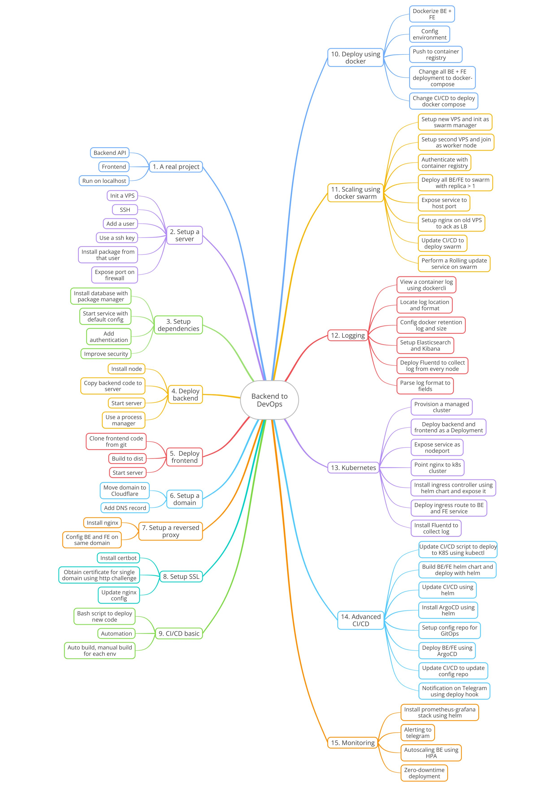

# devops-training

Devops Training materials

## How to use this repository

This repository contains the materials for the DevOps training path. It's a step-by-step guideline to learn DevOps practices and tools from basic things like setting up a server to advanced topics like deploying applications using Kubernetes. The training is designed to be self-paced and hands-on. You will learn by doing and make mistakes, not just by reading or watching tutorial videos. I'll not teach you anything, but I'll guide you to learn by yourself and keep you on the right track.

The training is divided into multiple modules. Each module is a separate folder in this repository. You must fork this repository to your own GitHub account and clone it to your local machine. You can then follow the instructions in each module to complete the training. On each step, you should add your knowledge and notes to the training materials for future reference.

The modules are as follows:

1. [Module 1: Preparing project](01-preparing-project/README.md)
2. [Module 2: Setup a server](02-setup-server/README.md)
3. [Module 3: Setup dependencies](03-setup-dependencies/README.md)
4. [Module 4: Deploy backend](04-deploy-backend/README.md)
5. [Module 5: Deploy frontend](05-deploy-frontend/README.md)
6. [Module 6: Setup a domain](06-setup-domain/README.md)
7. [Module 7: Setup a reverse proxy](07-setup-reverse-proxy/README.md)
8. [Module 8: Setup SSL](08-setup-ssl/README.md)
9. [Module 9: CI/CD basics](09-cicd-basics/README.md)
10. [Module 10: Deploy using docker](10-deploy-using-docker/README.md)
11. [Module 11: Deploy using Swarm](11-deploy-using-swarm/README.md)
12. [Module 12: Logging](12-logging/README.md)
13. [Module 13: Deploy using Kubernetes](13-deploy-using-kubernetes/README.md)
14. [Module 14: Advanced CI/CD](14-advanced-cicd/README.md)
15. [Module 15: Monitoring](15-monitoring/README.md)

## Structure of a module

Each module contains the following information:

- **Requirements**: What you need to do aka what is the goal of the module.
- **Basic instructions**: Basic steps to complete the module or hints. Just a skeleton to get you started.

You will have your time to research, learn, and implement the module. You can add your notes, commands, and configurations to the module's folder. You can also add your questions, thoughts, and ideas to the module's README file. After that, ping me to review your work and give you feedback.

## What will you do if you feel everything is too easy?

Well, everything has a starting point. In the beginning it might be easy and you will feel like you are not learning anything new. But as you progress and write down your notes, you will see that some basic things are not that basic. There's a lot of knowledge behind them. By listing down all of the fragments of knowledge, you will see the big picture and understand how everything is connected. So, don't rush, take your time, and enjoy the learning process.